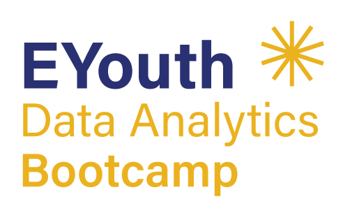

# E-Youth-Bootcamp-Banking-Analytics-Project

  

# 💼 Azure-Based Banking Intelligence & Analytics System

This project was developed as part of the **E-Youth Bootcamp** to build a comprehensive banking intelligence and analytics system using **Microsoft Azure**, **SQL**, **Power BI**, and **machine learning**.

The system enables banking institutions to gain deep insights into customer behavior, loan activities, transactions, and support efficiency through interactive dashboards and predictive models.

---

## 📊 Project Overview

The main objectives of this project are to:

- Analyze banking operations using SQL queries and Power BI
- Build dashboards that offer executive-le
